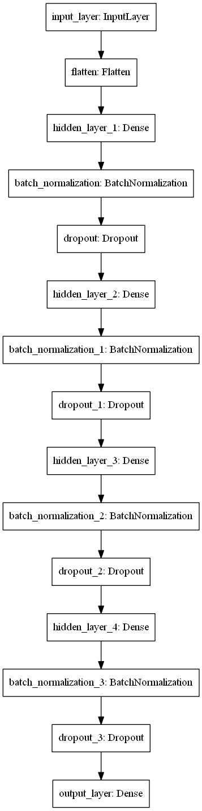
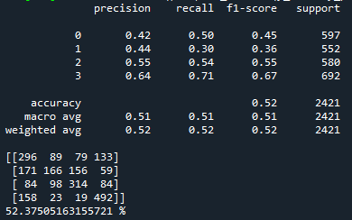
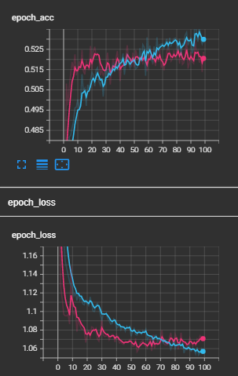

# Customer Segmentation (updated)
Creating a deep learning model where customers are classified into 4 segments (A, B, C, D) based on customer’s gender, age, profession, spending pattern, and etc
for a company to design a marketing strategy to target the most profitable segments.

# Description
This repository contains 3 python files (train.py, deploy.py, modules.py).

train.py contains the codes to build a deep learning model and train on train.csv dataset.

deploy.py contains the codes to deploy the deep learning model and predict new_customers.csv to produce the segmentation output.

module.py contains the codes where there are class and functions to be used in train.py and deploy.py

#How run Tensorboard

1. Clone this repository and use the model.h5 and ohe.pkl (inside saved_model folder) to deploy on your dataset.
2. Run tensorboard at the end of training to see how well the model perform via Anaconda prompt. Activate the correct environment.
3. Type "tensorboard --logdir "the log path"
4. Paste the local network link into your browser and it will automatically redirected to tensorboard local host and done! Tensorboard is now can be analyzed.

# The Architecture of Model

# The Performance of model

# Tensorboard screenshot from my browser

# Discussion
Based on the assignment given, we are required to create a deep learning model with accuracy 80%. However, I only manage to produce a deep learning model with accuracy 52%. There is an increment in the accuracy score compared to previous practice which was 20%. However, I am still not satisfied with this accuracy. 

My intake from the training dataset is we would need more customers' information to be added in the data so that the model can learn the pattern of the data very efficiently. Moreover, other approachs such as adding more layers, increasing number of nodes and epochs can be done to gain higher accuracy.

Throughout of doing this process, I have spent hours on cleaning the data only. I eliminated the features that shows weak trends and contain a big number of null values. However, the model still obtain a low accuracy score.

In conclusion, the performance of the deep learning model that i build is poorly accurate which will cause the prediction of any new data will be unaccurate. In the future, this will cause a company fail to design a marketing strategy to target the most profitable segments.

# Credit
Big thanks to the owner of our dataset: https://www.kaggle.com/datasets/abisheksudarshan/customer-segmentation
